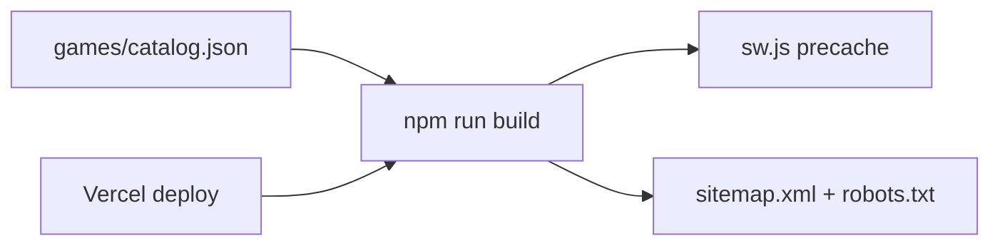

# Mohammed Al-Omari — Portfolio & M.GAMES

Personal portfolio and browser games hub for **Mohammed Al-Omari** (Backend Software Engineer). A static, framework-free site built with vanilla HTML, CSS, and JavaScript — optimized for SEO, performance, offline play, and deployment on Vercel.

**Live site:** [mohammedalomari.dev](https://mohammedalomari.dev)  
**Games hub:** [mohammedalomari.dev/games](https://mohammedalomari.dev/games)

---

## Table of contents

- [Features](#features)
- [Tech stack](#tech-stack)
- [Project structure](#project-structure)
- [Getting started](#getting-started)
- [Scripts](#scripts)
- [Build & deployment](#build--deployment)
- [Games (M.GAMES)](#games-mgames)
- [Service worker & offline](#service-worker--offline)
- [SEO](#seo)
- [Security](#security)
- [Testing](#testing)
- [CI/CD](#cicd)
- [Adding a new game](#adding-a-new-game)
- [Environment variables](#environment-variables)
- [License](#license)

---

## Features

### Portfolio

- Animated hero and sections powered by **GSAP** + **ScrollTrigger**
- WebGL-style background scene with performance tiering (`js/perf.js`, `js/scene.js`)
- Responsive layout, magnetic buttons, tilt cards, typewriter effects
- Project showcase with WebP images and lazy loading
- Structured data (JSON-LD), Open Graph, Twitter cards, canonical URLs
- Vercel Speed Insights & Web Analytics

### M.GAMES — 13 browser games

| Game | Type | Highlights |
|------|------|------------|
| Wordle | DOM | NYT-style scoring, keyboard, streak stats |
| Snake | Canvas | Speed progression, touch D-pad |
| Tetris | Canvas | 7-bag randomizer, ghost piece, levels |
| Flappy Bird | Canvas | Pipes, high score |
| Building Tower | Canvas | Stack blocks with timing |
| 2048 | DOM | Swipe + keyboard, best score |
| Memory Match | DOM | 4×4 / 5×4 / 6×4 difficulties |
| Tic-Tac-Toe | DOM | Unbeatable minimax AI |
| Connect 4 | DOM | Drop discs vs AI |
| Space Shooter | Canvas | Enemies, bullets, high score |
| Whack-a-Mole | DOM | 30-second reflex challenge |
| Pong | Canvas | Paddle vs AI, first to 7 |
| Dice Wars | Canvas | Best-of-5 dice duel |

All games are **vanilla JS**, have **classic-inspired skins** (`games/game-skins.css`), and share chrome via `games/shared.css` + `games/game-ui.js`.

---

## Tech stack

| Layer | Choice |
|-------|--------|
| Markup / style | HTML5, CSS3 (no Tailwind, no React) |
| Scripting | Vanilla JavaScript (ES modules where needed) |
| Animation | GSAP 3, ScrollTrigger |
| 3D / scene | Custom canvas scene (`js/scene.js`) |
| Games | Canvas + DOM, per-game `*.js` files |
| PWA | Service worker (`sw.js`) with precache |
| Hosting | [Vercel](https://vercel.com) (static output) |
| Tests | [Vitest](https://vitest.dev) (unit), [Playwright](https://playwright.dev) (e2e) |
| Local server | Node `server.js` (clean URLs) or `serve` (e2e) |

No production npm runtime dependencies — only dev tooling.

---

## Project structure

```
new-portfolio/
├── index.html              # Portfolio homepage
├── style.css               # Portfolio styles
├── script.js               # GSAP, interactions, loader
├── 404.html                # Custom 404 (noindex)
├── sw.js                   # Service worker (generated — do not hand-edit precache list)
├── sitemap.xml             # Sitemap (generated from catalog.json)
├── robots.txt              # Crawl rules + sitemap URL (partially generated)
├── vercel.json             # Deploy config, security headers, rewrites
├── server.js               # Local dev server with cleanUrls
│
├── js/
│   ├── perf.js             # Device tier detection, animation loop
│   └── scene.js            # Background scene
│
├── Images/                 # Logo, OG image, project screenshots (PNG/WebP)
│
├── games/
│   ├── index.html          # Games catalog hub
│   ├── catalog.json        # Source of truth — 13 games (slug, title, genre, …)
│   ├── games.css           # Hub page styles
│   ├── shared.css          # Shared game chrome (header, HUD, overlay)
│   ├── game-skins.css      # Per-game classic skins (body.game--{slug})
│   ├── game-ui.js          # Pause-on-blur, P key, HUD helpers
│   ├── *.html / *.js       # One pair per live game
│   ├── logic/              # Test-only logic modules (not wired to HTML yet)
│   ├── data/               # JSON data for future logic-only games
│   └── tests/              # Vitest unit tests
│
├── scripts/
│   ├── update-sw.mjs       # Regenerate sw.js precache from catalog.json
│   ├── generate-sitemap.mjs
│   ├── build-catalog.mjs   # Helper to rebuild catalog metadata
│   └── …                   # Legacy game generator scripts
│
├── e2e/                    # Playwright smoke tests
├── .github/workflows/      # GitHub Actions
└── package.json
```

### Build pipeline



`games/catalog.json` drives the games hub, service worker precache, and sitemap. After changing the catalog or adding a game, always run `npm run build` before deploy.

---

## Getting started

### Prerequisites

- **Node.js** 20+ (matches CI)
- **npm** 9+

### Install

```bash
git clone https://github.com/0marii/new-portfolio.git
cd new-portfolio
npm ci
```

### Local development

**Recommended** — Node server with clean URLs (matches Vercel routing):

```bash
npm start
# → http://localhost:3000
# /games/wordle → games/wordle.html
```

**Alternative** — simple static server:

```bash
npm run start:python
# → http://localhost:3000 (no cleanUrl rewrite)
```

Open the portfolio at `/` and games at `/games/`.

---

## Scripts

| Command | Description |
|---------|-------------|
| `npm start` | Local dev server (`server.js`, port 3000) |
| `npm run build` | Regenerate `sw.js` + `sitemap.xml` from `catalog.json` |
| `npm run generate:sw` | Update service worker only |
| `npm run generate:sitemap` | Update sitemap + robots sitemap line |
| `npm run build:catalog` | Rebuild `games/catalog.json` metadata |
| `npm test` | Vitest unit tests (`games/tests/`) |
| `npm run test:watch` | Vitest watch mode |
| `npm run test:e2e` | Playwright smoke tests (starts `serve` on 4173) |

---

## Build & deployment

### Vercel

The project is configured for zero-config static deploy:

- **Build command:** `npm run build`
- **Output directory:** `.` (repo root)
- **Clean URLs:** enabled (`/games/wordle` → `games/wordle.html`)
- **404:** fallback to `404.html`

Push to your connected Git branch; Vercel runs the build, bumps the service worker precache, and publishes.

### Pre-deploy checklist

1. Run `npm run build` locally (or rely on Vercel build).
2. Run `npm test` and `npm run test:e2e`.
3. Commit generated `sw.js` and `sitemap.xml` if you built locally.
4. Verify `/`, `/games/`, and `/sitemap.xml` after deploy.

---

## Games (M.GAMES)

### Architecture

- **Live games:** self-contained `games/{slug}.html` + `games/{slug}.js` (tower uses `tower-game.js`).
- **Shared UI:** `shared.css`, `game-skins.css`, `game-ui.js`.
- **Catalog:** `games/catalog.json` — slugs must match filenames.
- **Skins:** add `class="game--{slug}"` on `<body>` and styles under `body.game--{slug}` in `game-skins.css`.

### Logic-only modules

Eight modules under `games/logic/` (hangman, quiz, solitaire, etc.) have **Vitest coverage** but **no public HTML pages** yet. They are candidates for future games.

See [games/TESTING.md](games/TESTING.md) for manual QA checklist.

---

## Service worker & offline

`sw.js` uses versioned caches (`CACHE_VERSION`):

| Asset type | Strategy |
|------------|----------|
| HTML | Network-first, offline fallback |
| CSS / JS | Stale-while-revalidate |
| Images / fonts | Cache-first |
| CDN (fonts, GSAP) | Stale-while-revalidate |

Precache list is **auto-generated** by `scripts/update-sw.mjs` from `catalog.json`. Do not edit the `PRECACHE_STATIC` array by hand — run `npm run build`.

Registration: `index.html` and `games/index.html` register `/sw.js` on `load`.

---

## SEO

- **Canonical & hreflang** on homepage
- **JSON-LD:** `Person`, `WebSite`, project metadata
- **OG / Twitter** images: `Images/og-image.png` (1200×630)
- **Sitemap:** 15 URLs (home + games hub + 13 games)
- **robots.txt:** allows `/` and `/games/`, disallows config paths

Sitemap host resolves from `VERCEL_PROJECT_PRODUCTION_URL`, `VERCEL_URL`, or `SITE_URL` (default: `mohammedalomari.dev`).

---

## Security

`vercel.json` sets headers on all routes:

- Content-Security-Policy (self + trusted CDNs)
- Strict-Transport-Security (HSTS)
- `X-Frame-Options: DENY`
- `X-Content-Type-Options: nosniff`
- `Referrer-Policy`, `Permissions-Policy`
- `Cross-Origin-Opener-Policy: same-origin`

CDN scripts on the portfolio use **Subresource Integrity** (SRI) where applicable.

---

## Testing

### Unit tests (Vitest)

```bash
npm test
```

Covers `games/logic/*` — 27 tests across 8 modules.

### End-to-end (Playwright)

```bash
npm run test:e2e
```

16 smoke tests: homepage, 404, games catalog, and each of the 13 game pages (load + start).

### Manual game QA

Use the checklist in [games/TESTING.md](games/TESTING.md).

---

## CI/CD

GitHub Actions workflow: [`.github/workflows/games-test.yml`](.github/workflows/games-test.yml)

| Job | Runs |
|-----|------|
| `unit` | `npm test` |
| `e2e` | `npm run test:e2e` (Chromium) |

Triggered on push/PR when `games/**`, `index.html`, `script.js`, `style.css`, `e2e/**`, or test config changes.

---

## Adding a new game

1. Create `games/my-game.html` and `games/my-game.js`.
2. Link `shared.css`, `game-skins.css`, and `game-ui.js` in the HTML.
3. Set `<body class="game--my-game">` and add skin rules in `game-skins.css`.
4. Add an entry to `games/catalog.json` (`slug`, `title`, `genre`, `desc`, …).
5. Add a card in `games/index.html` (or run `npm run build:catalog` if using the catalog builder).
6. Run **`npm run build`** to update `sw.js` and `sitemap.xml`.
7. Add a Playwright smoke entry if you extend `e2e/games-smoke.spec.js` (it reads slugs from `catalog.json` automatically).
8. Run `npm test` and `npm run test:e2e`.

---

## Environment variables

| Variable | Used by | Default |
|----------|---------|---------|
| `PORT` | `server.js` | `3000` |
| `VERCEL_PROJECT_PRODUCTION_URL` | `generate-sitemap.mjs` | — |
| `VERCEL_URL` | `generate-sitemap.mjs` | — |
| `SITE_URL` | `generate-sitemap.mjs` | `mohammedalomari.dev` |

No secrets required for local dev or deploy.

---

## License

© Mohammed Al-Omari. All rights reserved.

Portfolio content, design, and game implementations are personal work. Third-party libraries (GSAP, Font Awesome, etc.) remain under their respective licenses.

---

## Author

**Mohammed Al-Omari** — Backend Software Engineer  
Amman, Jordan

- Website: [mohammedalomari.dev](https://mohammedalomari.dev)
- GitHub: [@0marii](https://github.com/0marii)
- LinkedIn: [mohammad-al-omari](https://www.linkedin.com/in/mohammad-al-omari-49b99311b/)
- Email: [mo.omari862@gmail.com](mailto:mo.omari862@gmail.com)
